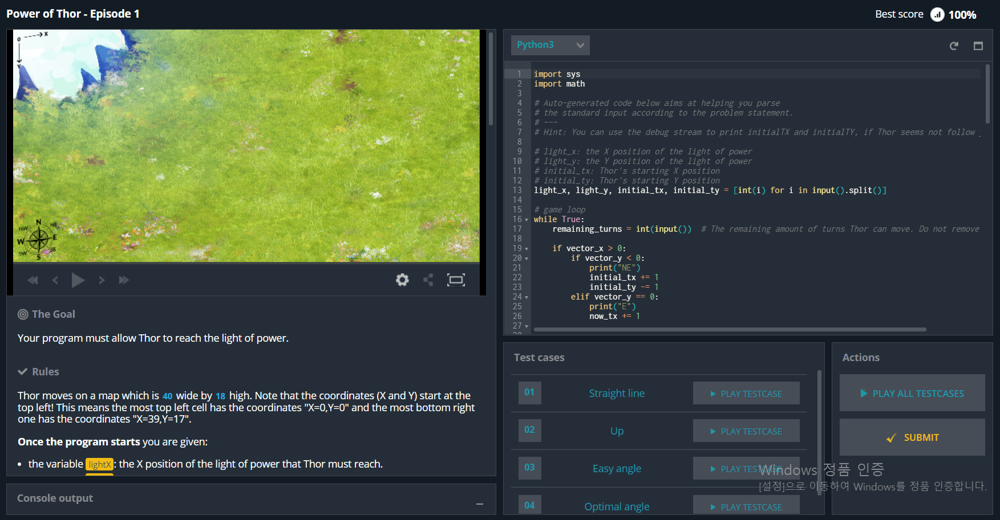
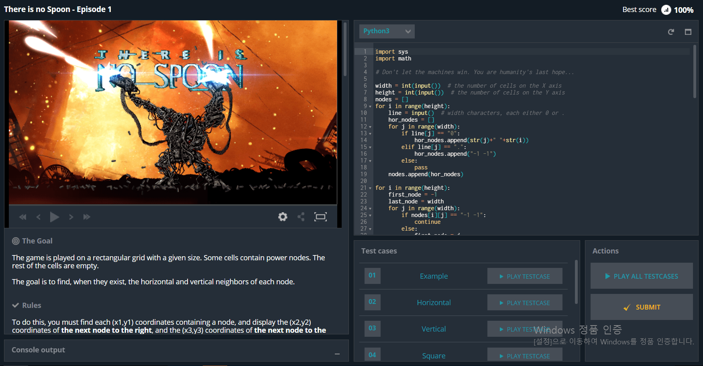
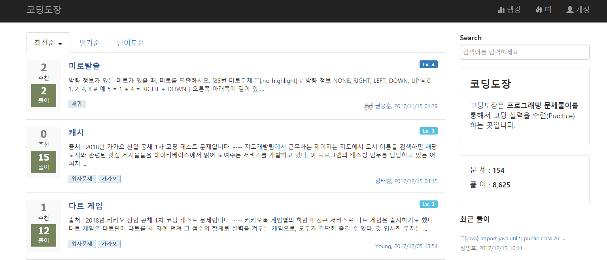

# 환영합니다! 재미그래밍입니다

 

>재미그래밍 0기 스터디를 할 때는 사실 재미그래밍이란 이름이 없었습니다. 단지 블랙루비 내의 스터디였을 뿐입니다.
>
>그런데 저희가 나름의 체계를 가지고 매주 공부를 해나가다 보니 도움이 많이 되었고, 그 과정에서 재미 또한 잃지 않고 즐겁게 공부할 수 있었습니다.
>
>만족스러웠던 이 스터디를 다른 사람들과도 같이 지속적으로 이어 나가고 싶어 재미그래밍이라는 이름의 스터디를 정식으로 만들어 지금까지 진행하고 있습니다.

## 재미그래밍 1기 스터디 소개

- - -

>재미그래밍 첫 정식 스터디 1기를 소개합니다.

### 일시

2017.08 ~ 2017.09 (6주)

### 인원 및 구성

블랙루비 개발자와 외부 직장인 총 8명

### 주제

파이썬 기초 및 심화

### 목표

- 파이썬 코드를 읽을 수 있고 파이썬 프로그램을 만들 수 있다.
- 파이썬을 이용해 코딩 문제를 풀 수 있다.

### 커리큘럼

- __전반 - 파이썬 기초__

  - 1주차: 점프투 파이썬 1~3장
  - 2주차: 점프투 파이썬 4~5장
  - 3주차: 점프투 파이썬 6장 + 복습

 

- __중간평가__ - easy 난이도 코딩게임 하기

 

- __후반 - 파이썬 심화__

  - 4주차: 모두의 파이썬 1~13장, 코딩도장 2문제
  - 5주차: 모두의 파이썬 14~17장, 코딩도장 2문제
  - 6주차: 모두의 파이썬 18~20장, 코딩도장 2문제

 

- __기말 평가__ - medium 난이도 코딩게임 하기

 

### 스터디 방식

- __한 달에 한 권__: 한 달에 한 권의 교재를 선정해 다 같이 공부해 나갑니다.

- __믿을 수 있는 강의__: 정해진 강사(블랙루비 개발자)가 일주일에 한 번 있는 모임에서 그 주 내용을 강의합니다.(최대 1시간)

- __실습 중심__: 공부하는 것도 중요하지만 그것을 직접 활용해보는 것도 매우 중요합니다. 매주 [코딩도장](http://codingdojang.com/)에 있는 코딩 문제와 중간평가, 기말평가 때 조금 시간을 들여야 하는 [코딩게임](https://www.codingame.com/star)을 해봅니다.

